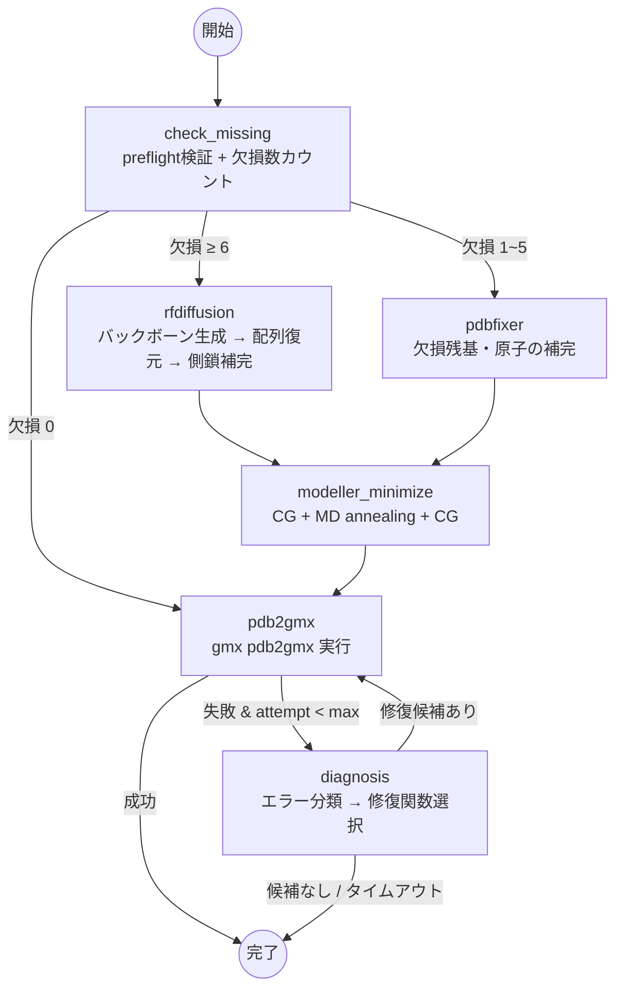

# GROMACS Recovery Agent

PDBの欠損残基をRFdiffusion（6残基以上）またはPDBFixer（1〜5残基）で修復し、`gmx pdb2gmx`が通るまで自動リトライするLangGraphエージェント。

## 使い方

```bash
python main.py --pdb-id 1AON
python main.py                # デフォルト: 1XYZ
```

## フロー



## 配列復元 (sequence_recovery.py)

RFdiffusionはバックボーンのみ生成し、新規残基は常にGLY。配列の復元は独立ステップで行う。

- 元PDBの実在残基先頭15残基をアンカーにFASTA内で`str.find()`
- オフセットを決定し、欠損resnum → `FASTA[resnum + offset]` を直接参照
- 同一テンプレートの鎖（ホモマー）は1回だけ計算して全鎖に適用

## 事前検証 (preflight.py)

`check_missing`ノードの最初に実行。1つでも失敗すれば即終了。

- `gmx` がPATH上にあるか
- RFdiffusionの`script_path` / `model_directory_path`が存在するか
- MODELLERライセンスキーが設定されているか
- RCSBから対象PDBが取得可能か

## config.yaml

```yaml
gromacs:
  force_field: "amber99sb-ildn"
  water_model: "tip3p"

agent:
  max_attempts: 10
  keep_work_dir: false
  output_dir: "results"
  repair_timeout_sec: 300

rfdiffusion:
  script_path: "/path/to/RFdiffusion/scripts/run_inference.py"
  model_directory_path: "/path/to/RFdiffusion/models"
  min_residues_for_rfdiffusion: 6
  num_designs: 1
  timeout_sec: 1800
  reassign_sequence_from_fasta: true
  fasta_cache_dir: "log/fasta_cache"

modeller:
  enabled: true
  license_key: "YOUR-MODELLER-LICENSE-KEY"
  neighbor_window: 3
  cg_iterations: 200
  md_iterations: 200
  timeout_sec: 600
```

## ディレクトリ構成

```
gromacs_recovery/
├── main.py                      # エントリポイント (--pdb-id)
├── config.yaml
├── environment.yml
└── recovery_agent/
    ├── graph.py                 # LangGraph StateGraph
    ├── preflight.py             # 事前検証
    ├── rfdiffusion_repair.py    # RFdiffusion実行・構造マージ
    ├── sequence_recovery.py     # アンカーベース配列復元
    ├── modeller_minimize.py     # MODELLER局所極小化
    ├── missing_residues.py      # 欠損残基数カウント
    ├── observation.py           # gmx pdb2gmx実行
    ├── diagnosis.py             # エラー分類
    ├── repair.py                # 修復関数群
    └── utils.py                 # タイムアウト付き実行
```

## 前提条件

| ソフトウェア | 用途 |
|---|---|
| GROMACS (`gmx`) | pdb2gmx |
| RFdiffusion + GPU (CUDA 12.8+) | バックボーン生成 |
| MODELLER (ライセンスキー要) | 局所エネルギー極小化 |
| Python 3.10, LangGraph, BioPython, PDBFixer, OpenMM | 基盤 |

## License

MIT
