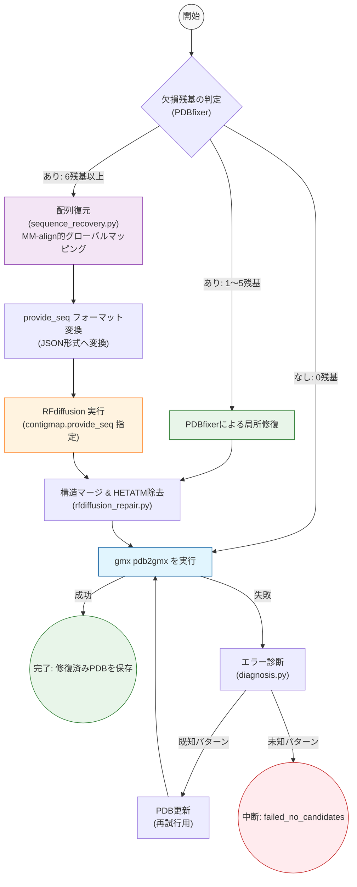
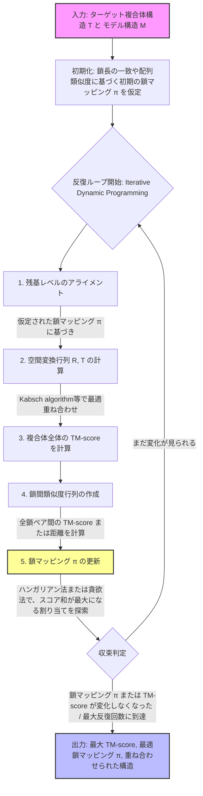
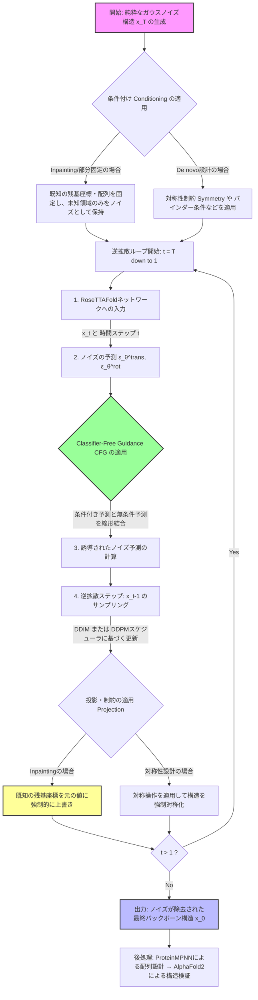

# GROMACS Recovery Agent (LangGraph + RFdiffusion)

PDBファイルを `gmx pdb2gmx` に通す際に発生するエラーを自動診断し、欠損残基の規模に応じて **RFdiffusion**（6残基以上の欠損）または **PDBfixer**（1〜5残基の欠損）で構造を修復したうえで、GROMACSの前処理（`pdb2gmx`）が成功するまで自動リトライする自律エージェントです。

制御フローは [LangGraph](https://github.com/langchain-ai/langgraph) の `StateGraph` で実装されており、マルチマー複合体における鎖の順序不一致にも耐えうる、構造生物学のドメイン知識を深く組み込んだ配列復元ロジックを搭載しています。

## 🔄 処理の流れ



---

## 🧠 理論的背景：堅牢な復元を支える2つのアルゴリズム

本エージェントが「PDBとFASTAで鎖の順番やIDが異なっていても正しく復元できる」理由と、「RFdiffusionが出力したGLYの羅列を正しい配列に戻せる」理由は、以下の2つのアルゴリズムの概念を応用しているためです。

### 1. MM-align 的思想によるグローバルな配列マッピング
**引用論文:** Mukherjee & Zhang, *"MM-align: a quick algorithm for aligning multiple-chain protein complex structures using iterative dynamic programming"*, Nucleic Acids Research, 2009.

マルチチェーン複合体において、PDBの鎖IDとFASTAの鎖IDが一致しない場合でも、**「複合体全体のアライメントスコアの総和」が最大となる1対1の鎖マッピング**をハンガリー法（`scipy.optimize.linear_sum_assignment`）で探索します。これにより、鎖の順序が入れ替わっていても、配列パターンに基づいて数学的に最適な対応関係を自動で見つけ出し、欠損領域（`X`）に正しいアミノ酸を割り当てます。

#### 📊 MM-align のアルゴリズムフロー


### 2. RFdiffusion の条件付き生成と投影 (Projection)
**引用論文:** Watson et al., *"De novo design of protein structure and function with RFdiffusion"*, Nature, 2023.

RFdiffusion は拡散モデルの「ノイズ予測の平均二乗誤差（MSE）」を最小化するように訓練されています。本エージェントでは、**Inpainting（部分補完）** モードを使用し、既存の残基座標を固定（Conditioning）した状態で未知領域のみをノイズから生成させます。特に `contigmap.provide_seq` を用いることで、FASTAから復元した正しいアミノ酸配列を条件として与え、物理的に妥当なバックボーン構造を生成します。

#### 📊 RFdiffusion の生成アルゴリズムフロー


---

## 🛠️ 1. 環境構築

### 1.1 前提条件
| ソフトウェア | 用途 | 備考 |
|---|---|---|
| Anaconda / Miniconda | 環境構築 | `conda` コマンドが使用可能であること |
| GROMACS (`gmx`) | 前処理（pdb2gmx）の実行 | `gmx` が PATH 上に存在すること |
| NVIDIA GPU (CUDA 12.8+) | RFdiffusion の推論 | CPU のみでは現実的な時間で完了しません |

### 1.2 GROMACS のインストール
conda環境とは別に、公式手順に従ってビルド・インストールし、`gmx` コマンドがPATHに通っていることを確認してください。
```bash
gmx --version
```

### 1.3 依存環境のセットアップ (conda)
本リポジトリ同梱の `environment.yml` を使用し、RFdiffusion および本エージェントに必要なパッケージを一括で構築します。

```bash
# 1. 環境の作成
conda env create -f environment.yml

# 2. 環境の有効化
conda activate gromacs_recovery_env # environment.yml で指定された名前を使用

# 3. RFdiffusion モデル重みのダウンロード (RFdiffusion リポジトリ内で行う場合)
# bash scripts/download_models.sh ./models
```

> **💡 注意点:**  
> 提供された `environment.yml` には `dgl==2.4.0+cu121` や `torch==2.7.1+cu128` など、最新かつ互換性の取れたバージョンが定義されています。手動でパッケージを入れる必要はありません。

---

## ⚙️ 2. 設定 (`config.yaml`)

```yaml
gromacs:
  force_field: "amber99sb-ildn"   # gmx pdb2gmx -ff
  water_model: "tip3p"            # gmx pdb2gmx -water

agent:
  max_attempts: 10                # pdb2gmx の最大試行回数
  log_dir: "log"                  # 実行ログ (recovery.log) と作業用一時ディレクトリの出力先
  keep_work_dir: false            # 作業用一時ディレクトリ (work_YYYYMMDD_HHMMSS) を残すか
  output_dir: "results"           # 修復成功後の最終 PDB の出力先

rfdiffusion:
  script_path: "/path/to/RFdiffusion/scripts/run_inference.py"   # 環境に合わせて絶対パスに変更
  model_directory_path: "/path/to/RFdiffusion/models"            # 環境に合わせて絶対パスに変更
  min_residues_for_rfdiffusion: 6   # この残基数以上の欠損は RFdiffusion へ、未満は PDBfixer へ
  num_designs: 1                    # RFdiffusion の生成数
  timeout_sec: 1800                 # RFdiffusion 実行のタイムアウト（秒）
  reassign_sequence_from_fasta: true # RFdiffusion 生成領域の配列を FASTA に基づき自動復元するか
  fasta_cache_dir: "log/fasta_cache" # FASTA 取得時のキャッシュディレクトリ
```

---

## 🚀 3. 使い方

### 3.1 最小実行例
`main.py` は同一ディレクトリの `broken_test.pdb` を読み込んで修復を試みます。
```bash
# 修復したい PDB ファイルを配置
cp your_broken_structure.pdb broken_test.pdb

# エージェント実行
python main.py
```
成功すると `results/broken_test_final.pdb` に修復済み PDB が保存されます。すべての経過は `log/recovery.log` に記録されます。

### 3.2 コードから直接利用する場合
```python
import yaml
import os
from recovery_agent.graph import build_graph

# 設定の読み込み
with open("config.yaml", "r", encoding="utf-8") as f:
    config = yaml.safe_load(f)

# グラフの構築
app = build_graph(config)

# 初期状態の定義
state = {
    "pdb_path": "your_structure.pdb",
    "work_dir": os.path.join("log", "work_custom"),
    "attempt": 0,
    "repair_history": [],
    "extra_flags": [],
}

# 実行
result = app.invoke(state, config={"recursion_limit": 100})

if result.get("success"):
    print(f"Success! Saved to: {result.get('pdb_path')}")
else:
    print(f"Failed: {result.get('status')}")
```

---

## 🔍 4. トラブルシューティング

本エージェントは、実データの PDB フォーマット特有の罠に対して以下の**堅牢な対策をコードレベルで実装済み**です。
- ✅ **挿入コード (Insertion Code) 対策**: `_parse_resnum` により `100A` のような残基IDでも数値部分を安全に抽出。
- ✅ **`.trb` パースエラー対策**: `con_hal_pdb_idx` の文字列リストを安全にスライスして分解。
- ✅ **HETATM 重複除去**: RFdiffusion 統合時、同一残基番号を持つ水分子等の HETATM を自動的に一掃。

それでも問題が発生した場合は以下を確認してください。

| 症状 | 対処 |
|---|---|
| `EnvironmentError: GROMACS ('gmx' command) is not found` | GROMACS をインストールし、`gmx` に PATH を通してください。 |
| `ModuleNotFoundError: No module named 'rfdiffusion'` | `environment.yml` で定義された環境が正しく activate されているか確認してください。 |
| `pdb2gmx` が毎回同じエラーで失敗し、`failed_no_candidates` になる | `log/recovery.log` を確認し、`diagnosis.py` の分類ルールに該当事象が定義されているか確認してください。 |
| RFdiffusion がタイムアウトする | `config.yaml` の `timeout_sec` を延長するか、GPU のメモリ不足 (`CUDA out of memory`) が発生していないか確認してください。 |

---

## 📂 5. ディレクトリ構成

```text
gromacs_recovery/
├── main.py                          # エントリーポイント
├── config.yaml                      # 設定ファイル
├── environment.yml                  # 依存環境定義 (Python 3.10 / PyTorch 2.7 / DGL 2.4)
├── recovery_agent/
│   ├── graph.py                     # LangGraph による修復フロー本体
│   ├── missing_residues.py          # 欠損残基数のカウント
│   ├── rfdiffusion_repair.py        # RFdiffusion 呼び出し・統合・配列条件付き生成
│   ├── sequence_recovery.py         # MM-align的思想に基づくグローバル配列復元
│   ├── observation.py               # gmx pdb2gmx の実行と出力キャプチャ
│   ├── diagnosis.py                 # pdb2gmx のエラー分類
│   ├── repair.py                    # PDBfixer/Biopython による個別修復関数群
│   └── utils.py                     # タイムアウト付き関数実行
├── log/                             # 実行時に自動作成
└── results/                         # 修復成功後の最終 PDB 出力先
```
