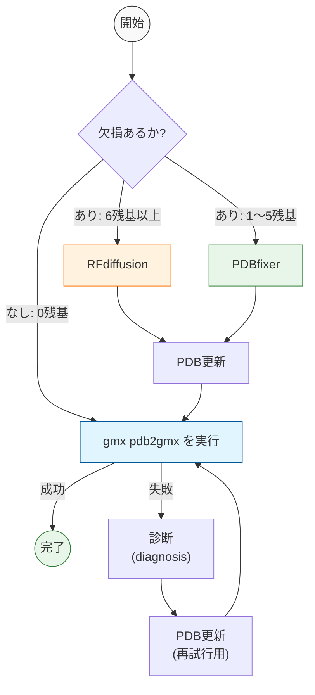

# GROMACS Recovery Agent (LangGraph + RFdiffusion)

PDBファイルを `gmx pdb2gmx` に通す際に発生するエラーを自動診断し、欠損残基の規模に応じて
**RFdiffusion**（6残基以上の欠損）または **PDBfixer**（1〜5残基の欠損）で構造を修復したうえで、
GROMACSの前処理（`pdb2gmx`）が成功するまで自動リトライするエージェントです。
制御フローは [LangGraph](https://github.com/langchain-ai/langgraph) の `StateGraph` で実装しています。

## 処理の流れ



---

## 1. 環境構築

### 1.1 前提条件

| ソフトウェア | 用途 | 備考 |
|---|---|---|
| Python 3.10以上 | 全体の実行環境 | 3.12で動作確認 |
| GROMACS（`gmx`コマンド） | 前処理（pdb2gmx）の実行 | `gmx`がPATH上にあること |
| RFdiffusion | 大きな欠損（6残基以上）の補完 | GPU（CUDA対応）を推奨 |

### 1.2 GROMACSのインストール

公式手順に従ってビルド・インストールし、`gmx`コマンドがPATHに通っていることを確認してください。

```bash
gmx --version
```

### 1.3 RFdiffusionのセットアップ

本エージェントは `RFdiffusion` を **サブプロセスとして呼び出す**ため、事前に別途セットアップしておく必要があります。

```bash
git clone https://github.com/RosettaCommons/RFdiffusion.git
cd RFdiffusion

# 公式手順に従い環境構築（conda環境例）
conda env create -f env/SE3nv.yml
conda activate SE3nv
pip install -e .

# 学習済みモデル重みをダウンロード（公式スクリプト）
bash scripts/download_models.sh ./models
```

セットアップ後、`config.yaml` に以下のパスを設定します（後述）。

- `scripts/run_inference.py` の絶対パス
- ダウンロードした重みディレクトリ（`./models`）の絶対パス

> RFdiffusionの実行にはNVIDIA GPU（CUDA）が事実上必須です。CPUのみの環境では現実的な時間で完了しません。

### 1.4 Pythonパッケージのインストール

本リポジトリ用の仮想環境を作成し、以下をインストールします。

```bash
python3 -m venv venv
source venv/bin/activate   # Windowsの場合: venv\Scripts\activate

pip install langgraph pdbfixer openmm biopython pyyaml
```

| パッケージ | 用途 |
|---|---|
| `langgraph` | 修復フローの状態遷移グラフ（本体） |
| `pdbfixer` / `openmm` | 欠損残基のカウント・小規模欠損の修復（1〜5残基） |
| `biopython` | 鎖ID重複修正・不要残基除去などの構造編集 |
| `pyyaml` | `config.yaml` の読み込み |

> `RFdiffusion`用のconda環境（SE3nv）と本エージェント用のPython環境は、依存パッケージの衝突を避けるため**別環境として分離**することを推奨します。エージェント側からは `subprocess` 経由でRFdiffusion側のPythonを呼び出す構成になっているため、`config.yaml` の `script_path` にRFdiffusion環境の `run_inference.py` を指定してください。

---

## 2. 設定（config.yaml）

```yaml
gromacs:
  force_field: "amber99sb-ildn"   # gmx pdb2gmx -ff
  water_model: "tip3p"            # gmx pdb2gmx -water

agent:
  max_attempts: 10                # pdb2gmxの最大試行回数
  log_dir: "logs"                 # 実行ログの出力先
  keep_work_dir: false            # 作業用一時ディレクトリを残すか
  output_dir: "results"           # 修復成功後の最終PDBの出力先

rfdiffusion:
  script_path: "/path/to/RFdiffusion/scripts/run_inference.py"   # ← 環境に合わせて変更
  model_directory_path: "/path/to/RFdiffusion/models"            # ← 環境に合わせて変更
  min_residues_for_rfdiffusion: 6   # この残基数以上の欠損はRFdiffusionへ、未満はPDBfixerへ
  num_designs: 1                    # RFdiffusionの生成数
  timeout_sec: 1800                 # RFdiffusion実行のタイムアウト（秒）
```

`script_path` と `model_directory_path` は、1.3節でセットアップしたRFdiffusionの実際のパスに書き換えてください。

---

## 3. 使い方

### 3.1 最小実行例

`main.py` は同一ディレクトリの `broken_test.pdb` を読み込んで修復を試みます。

```bash
# 修復したいPDBファイルを配置
cp your_broken_structure.pdb broken_test.pdb

python main.py
```

成功すると `results/broken_test_final.pdb` に修復済みPDBが保存されます。
失敗した場合は終了ステータス（`failed_no_candidates` など）が標準出力に表示されます。

### 3.2 任意のPDBファイル・設定で実行する（コードから利用する場合）

```python
import yaml, tempfile
from recovery_agent.graph import build_graph

with open("config.yaml") as f:
    config = yaml.safe_load(f)

app = build_graph(config)

state = {
    "pdb_path": "your_structure.pdb",
    "work_dir": tempfile.mkdtemp(),
    "attempt": 0,
    "repair_history": [],
    "extra_flags": [],
}

result = app.invoke(state, config={"recursion_limit": 100})

print(result["success"], result.get("status"), result.get("pdb_path"))
```

### 3.3 分岐条件の変更

`config.yaml` の `rfdiffusion.min_residues_for_rfdiffusion` を変更することで、
「RFdiffusionを使うか／PDBfixerを使うか」の欠損残基数の閾値（デフォルト6残基）を調整できます。

---

## 4. トラブルシューティング

| 症状 | 対処 |
|---|---|
| `EnvironmentError: GROMACS ('gmx' command) is not found in PATH.` | GROMACSをインストールし、`gmx`にPATHを通してください |
| RFdiffusion呼び出しで `RuntimeError: RFdiffusion failed: ...` | `config.yaml` の `script_path` / `model_directory_path` が正しいか、RFdiffusion用のconda環境がactivateされた状態でPythonが呼ばれているか確認してください |
| `pdb2gmx` が毎回同じエラーで失敗する | `logs/` 以下のログ、および `diagnosis.py` の分類ルールに該当エラーが定義されているか確認してください |
| 最大試行回数で終了する | `config.yaml` の `agent.max_attempts` を増やす、または対象PDBの欠損箇所を手動確認してください |

---

## 5. ディレクトリ構成

```
gromacs_recovery-main/
├── main.py                          # エントリーポイント
├── config.yaml                      # 設定ファイル
├── recovery_agent/
│   ├── graph.py                     # LangGraphによる修復フロー本体
│   ├── missing_residues.py          # 欠損残基数のカウント（PDBfixer）
│   ├── rfdiffusion_repair.py        # RFdiffusion呼び出し（6残基以上の欠損）
│   ├── observation.py               # gmx pdb2gmxの実行
│   ├── diagnosis.py                 # pdb2gmxのエラー分類
│   ├── repair.py                    # PDBfixer/Biopythonによる個別修復関数群
│   └── utils.py                     # タイムアウト付き関数実行
└── tests/
```
