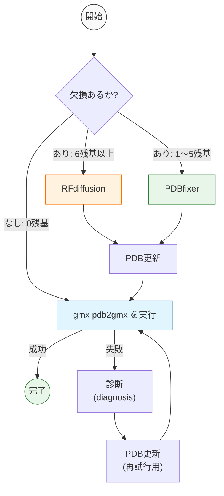
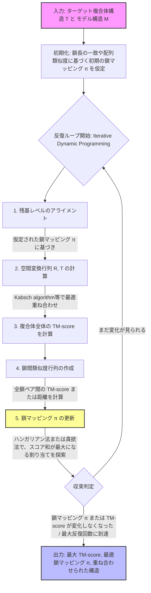

# GROMACS Recovery Agent (LangGraph + RFdiffusion)

PDBファイルを `gmx pdb2gmx` に通す際に発生するエラーを自動診断し、欠損残基の規模に応じて
**RFdiffusion**（6残基以上の欠損）または **PDBfixer**（1〜5残基の欠損）で構造を修復したうえで、
GROMACSの前処理（`pdb2gmx`）が成功するまで自動リトライするエージェントです。
制御フローは [LangGraph](https://github.com/langchain-ai/langgraph) の `StateGraph` で実装しています。

## 処理の流れ



 **「MM-align: a quick algorithm for aligning multiple-chain protein complex structures using iterative dynamic programming」** (Mukherjee & Zhang, *Nucleic Acids Research*, 2009) の核心である「目的関数」と、そのアルゴリズムの全体像を把握するための「Mermaid `graph TD`」を以下にま

### 🎯 MM-align の目的関数 (Objective Function)

MM-align の目的は、2つのマルチチェーンタンパク質複合体（ターゲット構造 $T$ とモデル構造 $M$）の間で、**「複合体全体の TM-score (TM-score$_{\text{complex}}$)」を最大化する** ことです。

数式では以下のように定義されます。

$$ \text{Maximize} \quad \text{TM-score}_{\text{complex}} = \frac{1}{L_{\text{target}}} \sum_{k=1}^{N_{\text{map}}} \sum_{i=1}^{L_k} \frac{1}{1 + \left( \frac{d_{k,i}}{d_0(L_{\text{target}})} \right)^2} $$

**変数の意味:**
- $L_{\text{target}}$ : ターゲット複合体全体の総アミノ酸残基数（正規化のための基準長さ）
- $N_{\text{map}}$ : マッピングされた鎖（チェーン）ペアの数
- $L_k$ : $k$ 番目の鎖ペア間でアライメントされた残基対の数
- $d_{k,i}$ : $k$ 番目の鎖ペアにおける、$i$ 番目のアライメントされた残基対間のユークリッド距離
- $d_0(L_{\text{target}})$ : 長さ依存のスケーリング因子（通常 $1.24 \sqrt[3]{L_{\text{target}} - 15} - 1.8$）

**最適化すべき2つの変数:**
このスコアを最大化するために、アルゴリズムは以下の2つを**同時に**探索します。
1. **空間変換 $(R, T)$** : 回転行列 $R$ と並進ベクトル $T$（構造を重ね合わせるための物理的な変換）
2. **鎖マッピング $\pi$** : モデル側の鎖とターゲット側の鎖を、どの組み合わせで対応付けるかという「割り当て（Permutation）」

つまり、目的関数は **「どの鎖をどの鎖に対応させ（$\pi$）、どう空間重ね合わせすれば（$R, T$）、複合体全体の構造的類似度（TM-score）が最高になるか」** を求めるものになります。

---

### 📊 MM-align のアルゴリズムフロー (`graph TD`)

この目的関数を解くために、MM-align は **「反復動的計画法 (Iterative Dynamic Programming)」** を採用しています。以下の Mermaid コードは、その処理フローを可視化したものです。



---


## 1. 環境構築

### 1.1 前提条件

| ソフトウェア | 用途 | 備考 |
|---|---|---|
| Anaconda / Miniconda | 環境構築 | `conda`コマンドが使えること |
| GROMACS（`gmx`コマンド） | 前処理（pdb2gmx）の実行 | `gmx`がPATH上にあること（別途インストール） |
| RFdiffusion | 大きな欠損（6残基以上）の補完 | GPU（CUDA 12.1対応）を推奨 |

本エージェント（`gromacs_recovery`）とRFdiffusionは、依存パッケージの衝突を避けるため
**1つのconda環境（`SE3nv`）に同梱**する構成にしています。動作確認済み: **Python 3.10 / PyTorch 2.4.1 / CUDA 12.1 / dgl 1.1.3**。

### 1.2 GROMACSのインストール

conda環境とは別に、公式手順に従ってビルド・インストールし、`gmx`コマンドがPATHに通っていることを確認してください。

```bash
gmx --version
```

### 1.3 RFdiffusion + gromacs_recovery のconda環境構築

```bash
git clone https://github.com/RosettaCommons/RFdiffusion.git
cd RFdiffusion
```

本リポジトリ同梱の `environment.yml` を **RFdiffusionリポジトリの直下** にコピーしてから実行してください
（`pip`セクション内の `-e ./env/SE3Transformer` と `-e .` はこの `environment.yml` 自身の場所からの相対パスとして解決されるため、置き場所が重要です）。

```bash
cp /path/to/gromacs_recovery/environment.yml ./environment.yml

conda env create -f environment.yml
conda activate SE3nv
```

これ1本で以下が全て行われます。

- Python 3.10 / PyTorch 2.4 / CUDA 12.1 の基盤構築
- `dgl==1.1.3`（`graphbolt`非搭載版。新しいdglだと`torchdata.datapipes`関連のエラーになるため固定）
- RFdiffusion本体が要求する依存（`hydra-core`, `omegaconf`, `e3nn` など）
- `env/SE3Transformer` → `rfdiffusion`本体 の順でのeditableインストール
- `gromacs_recovery`（本エージェント）側の依存（`langgraph`, `pdbfixer`, `openmm`, `biopython`, `pyyaml`）

動作確認:

```bash
python scripts/run_inference.py --help
python -c "import rfdiffusion, langgraph, pdbfixer; print('OK')"
```

続いて、学習済みモデル重みをダウンロードします。

```bash
bash scripts/download_models.sh ./models
```

`config.yaml` には以下のパスを設定します（後述）。

- `scripts/run_inference.py` の絶対パス
- ダウンロードした重みディレクトリ（`./models`）の絶対パス

> RFdiffusionの実行にはNVIDIA GPU（CUDA）が事実上必須です。CPUのみの環境では現実的な時間で完了しません。

#### うまくいかない場合（手動インストール）

`environment.yml`は`pip`セクションを1回の`pip install`にまとめて実行するため、
ローカルパッケージ（`env/SE3Transformer`・`rfdiffusion`本体）の依存解決順序によっては失敗することがあります。
その場合は以下の順序で手動インストールしてください（実機で動作確認済みの手順です）。

```bash
conda env create -f environment.yml   # 失敗しても基盤(python/pytorch/dgl等)は入る
conda activate SE3nv

cd RFdiffusion
pip install -e env/SE3Transformer   # 先にSE3Transformerを入れる
pip install -e .                    # 次にrfdiffusion本体
pip install "dgl==1.1.3" -f https://data.dgl.ai/wheels/torch-2.4/cu121/repo.html   # dglを対応版に固定
pip install langgraph pdbfixer openmm biopython pyyaml   # gromacs_recovery側の依存
```

---

## 2. 設定（config.yaml）

```yaml
gromacs:
  force_field: "amber99sb-ildn"   # gmx pdb2gmx -ff
  water_model: "tip3p"            # gmx pdb2gmx -water

agent:
  max_attempts: 10                # pdb2gmxの最大試行回数
  log_dir: "logs"                 # 実行ログの出力先
  keep_work_dir: false            # 作業用一時ディレクトリを残すか
  output_dir: "results"           # 修復成功後の最終PDBの出力先

rfdiffusion:
  script_path: "/path/to/RFdiffusion/scripts/run_inference.py"   # ← 環境に合わせて変更
  model_directory_path: "/path/to/RFdiffusion/models"            # ← 環境に合わせて変更
  min_residues_for_rfdiffusion: 6   # この残基数以上の欠損はRFdiffusionへ、未満はPDBfixerへ
  num_designs: 1                    # RFdiffusionの生成数
  timeout_sec: 1800                 # RFdiffusion実行のタイムアウト（秒）
```

`script_path` と `model_directory_path` は、1.3節でセットアップしたRFdiffusionの実際のパスに書き換えてください。

---

## 3. 使い方

### 3.1 最小実行例

`main.py` は同一ディレクトリの `broken_test.pdb` を読み込んで修復を試みます。

```bash
# 修復したいPDBファイルを配置
cp your_broken_structure.pdb broken_test.pdb

python main.py
```

成功すると `results/broken_test_final.pdb` に修復済みPDBが保存されます。
失敗した場合は終了ステータス（`failed_no_candidates` など）が標準出力に表示されます。

### 3.2 任意のPDBファイル・設定で実行する（コードから利用する場合）

```python
import yaml, tempfile
from recovery_agent.graph import build_graph

with open("config.yaml") as f:
    config = yaml.safe_load(f)

app = build_graph(config)

state = {
    "pdb_path": "your_structure.pdb",
    "work_dir": tempfile.mkdtemp(),
    "attempt": 0,
    "repair_history": [],
    "extra_flags": [],
}

result = app.invoke(state, config={"recursion_limit": 100})

print(result["success"], result.get("status"), result.get("pdb_path"))
```

### 3.3 分岐条件の変更

`config.yaml` の `rfdiffusion.min_residues_for_rfdiffusion` を変更することで、
「RFdiffusionを使うか／PDBfixerを使うか」の欠損残基数の閾値（デフォルト6残基）を調整できます。

---

## 4. トラブルシューティング

| 症状 | 対処 |
|---|---|
| `EnvironmentError: GROMACS ('gmx' command) is not found in PATH.` | GROMACSをインストールし、`gmx`にPATHを通してください |
| `ModuleNotFoundError: No module named 'rfdiffusion'` | `rfdiffusion`本体がインストールされていません。1.3節の手順で `env/SE3Transformer` → `.` の順にeditableインストールしてください |
| `pip install -e .` で `No matching distribution found for se3-transformer` | `rfdiffusion`の依存`se3-transformer`はPyPI非公開のローカルパッケージです。先に `pip install -e env/SE3Transformer` を実行してから `pip install -e .` してください |
| `ModuleNotFoundError: No module named 'torchdata.datapipes'` | dgl 2.x系の`graphbolt`が新しい`torchdata`と非互換です。`pip install "dgl==1.1.3" -f https://data.dgl.ai/wheels/torch-2.4/cu121/repo.html` で`graphbolt`非搭載版に固定してください |
| RFdiffusion呼び出しで `RuntimeError: RFdiffusion failed: ...`（上記以外） | `config.yaml` の `script_path` / `model_directory_path` が正しいか、`SE3nv`環境がactivateされた状態でPythonが呼ばれているか確認してください |
| `pdb2gmx` が毎回同じエラーで失敗する | `logs/` 以下のログ、および `diagnosis.py` の分類ルールに該当エラーが定義されているか確認してください |
| 最大試行回数で終了する | `config.yaml` の `agent.max_attempts` を増やす、または対象PDBの欠損箇所を手動確認してください |

---

## 5. ディレクトリ構成

```
gromacs_recovery-main/
├── main.py                          # エントリーポイント
├── config.yaml                      # 設定ファイル
├── environment.yml                  # RFdiffusion+本エージェント用conda環境定義（RFdiffusionリポジトリ直下に配置して使用）
├── recovery_agent/
│   ├── graph.py                     # LangGraphによる修復フロー本体
│   ├── missing_residues.py          # 欠損残基数のカウント（PDBfixer）
│   ├── rfdiffusion_repair.py        # RFdiffusion呼び出し（6残基以上の欠損）
│   ├── observation.py               # gmx pdb2gmxの実行
│   ├── diagnosis.py                 # pdb2gmxのエラー分類
│   ├── repair.py                    # PDBfixer/Biopythonによる個別修復関数群
│   └── utils.py                     # タイムアウト付き関数実行
└── tests/
```

